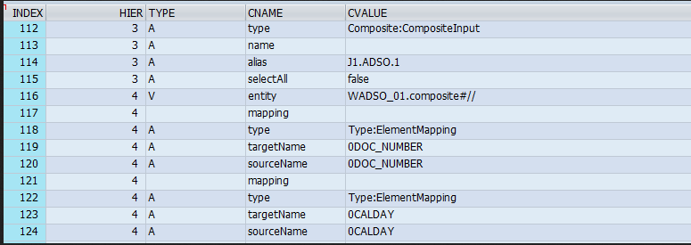

# BW_DISPLAY_HCPR_MAPPING

*When creating CompositeProviders in the new BW modeling tools in Eclipse it may become difficult to get a good overview of which InfoObjects from which InfoProviders are mapped in the Union or Join part, especially when your CompositeProvider contains many objects.*

*For MultiProviders we can use table RSDICMULTIIOBJ to get an overview of the mapping between source and target fields. However, since the definition of a CompositeProvider is stored as XML such a table does not exist for CompositeProviders. Although the XML of a CompositeProvider can be displayed in RSA1, ít’s difficult to read, even when you export the XML definition to Excel.*

*By making use of the attached program, it’s possible to display the mapping between InfoProvider fields and the CompositeProvider on your screen.*

Link zum Programm: [Mapping of InfoProvider fields in CompositeProvider](https://blogs.sap.com/2016/03/04/mapping-of-infoprovider-fields-in-compositeprovider/)

